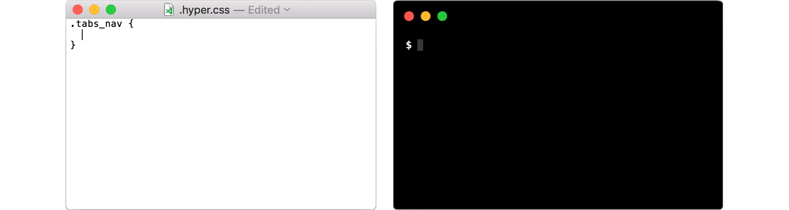

# hyper-stylesheet

> Adds support for an external [hyper](https://hyper.is) stylesheet

## Install

Either install with [hpm](https://github.com/zeit/hpm):

```bash
$ hpm install hyper-stylesheet
```

or add `hyper-stylesheet` to the `plugins` array in your `.hyper.js`

**Note**: if you want your CSS file to override all other plugins, it must be the last item in the `plugins` array

## Use

Open your `.hyper.css` file from the menu via `Hyper > Stylesheet...`. You can define the `css` and/or `termCSS` properties with the following indicators:

```css
/* #css */
.some-class {
  font-size: 20px;
}

/* #termCSS */
.some-class {
  color: #000;
}
```

`#css`/`#termCSS` are interchangeable with `#window`/`#terminal`. If no indicators are provided, the `css` property will be used

## Options

To provide options, add `hyper-stylesheet` to your `.hyper.js` config:

```javascript
module.exports = {
  config: {
    'hyper-stylesheet': {
      autoReload: false
    }
  },
  plugins: [
    'hyper-stylesheet'
  ]
}
```

### autoReload

Type: `boolean`

Default: `true`

Upon saving `.hyper.css`, your terminal will auto-reload to show the changes

## Contributing

If you're running hyper in dev mode ([info](https://github.com/zeit/hyper/issues/2568#issuecomment-355227246)), open your development config file (`.../[hyper-repo]/.hyper.js`) and provide the absolute path to itself:

```javascript
module.exports = {
  config: {
    'hyper-stylesheet': {
      CONFIG_PATH: '/path/to/.hyper.js',
    }
  }
}
```

`hyper-stylesheet` needs to be able to modify your config file to trigger auto-reload. This step allows the plugin to use your dev config file instead of the primary one

## License

[MIT](LICENSE)
